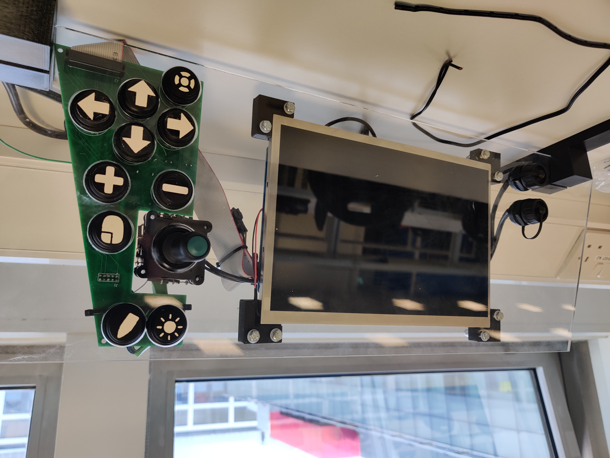
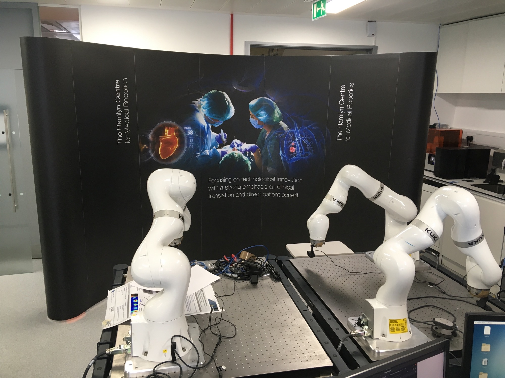
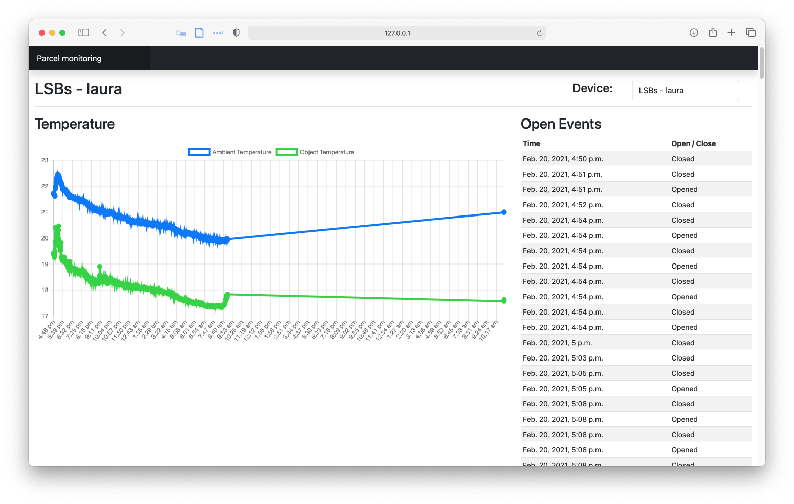

# About
I'm an Electrical and Electronic Engineering student at Imperial College London. My biggest interest is the crossover between computer security and electronic engineering, and I'm planning to move into a graduate role in the Cyber Security industry in 2022.

# Skills
* Proficient programming in Python, C++, C, Javascript, PHP, HTML.
* FPGA design using Verilog and the Intel Quartus Environment.
* Vulnerability discovery, research and proof-of-concept exploit using standard toolsets.
* Electronic device development and prototyping, including CAD and PCB design.

# Projects
## OpenSIMS

For the third year group project, my team worked with the charity Atlantic Pacific to develop an open-source, low-cost boat navigation system for use on their new "lifeboat in a box" scheme, where lifeboats are shipped to areas of coastline all over the world where drowning at sea is a real problem. Working from scratch to completely specify and design the product, we delivered a high-quality waterproofed prototype ready for ruggedisation and deployment.

## Royal Society Showcase 2021

During summer 2021 I led a student team to develop an online system which enabled a research team from the Faculty of Medicine to demonstrate surgical robots at the virtual Royal Society Showcase. The system allows participants to remotely control robots by tracking head movement through their webcam, with first-person video streamed back from the lab. The user uses this system to complete a game, creating a highly engaging virtual exhibition stall. 

## ShipTrackr

As part of the embedded systems module in third year, my team developed an IoT parcel monitoring system. The product facilitates temperature and box open and close monitoring, giving senders and recipients of high-value and temperature-sensitive parcels real time updates and piece of mind. 

                                                           
## Seatseeker
My team won first prize for the second year group project with our library seat availability tracking system. Via a web page which could be displayed on TVs around a library or on users' mobile phones, the availability of every seat in a library can be viewed. The system reliably identifies the availability of a seat via a low cost combination of Passive Infra-red (PIR) and ultrasonic distance sensing. Each individual "node", or cluster of desks, can be easily integrated into existing network infrastructure and configured by administrators in an easy-to-use interface.

## Graphic EQ
As a home project, I developed a Graphic EQ display, consisting of a LED matrix which displays the amplitude of various frequency bands from the ambient sounds in a room, fed from a microphone.
